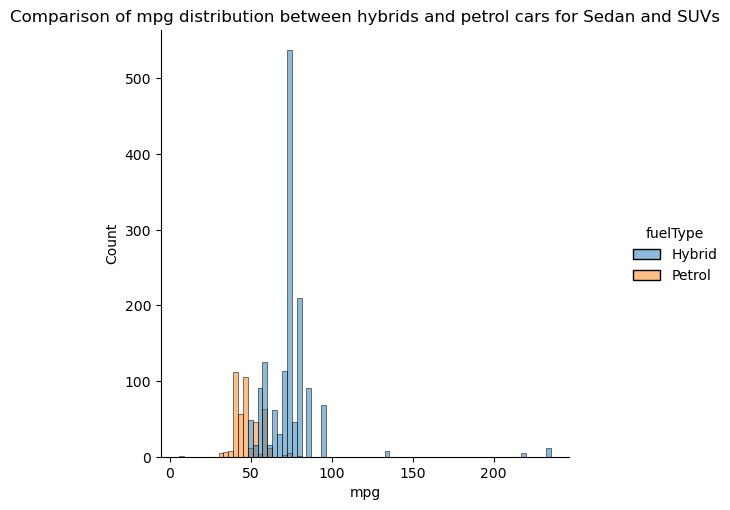

                 # **Defining best argument to launch a second hand e-car sale**

# **Abstract**
The marketing team would like to setup a campaign to sale e-cars. By 2030 only zero emission new cars will be on the market. Although this does not concern yet the second hand car, we need to be one step ahead and taste the water.  
To see what our customers trends are, I've been given the last 6 months cars sold. Although we haven't sold e-cars we do have a good dataset of hybrid cars. I used the hybrid cars sold as my point of comparison with the other types of cars.  

# **Overall comparison**
Here are the different variables I had in hand:  

Column    |    Non-Null Count | Dtype  
  ------    |    -------------- |   -----  
  model  |    6738 non-null  |  object 
  year   |    6738 non-null  |  int64  
  price  |    6738 non-null  |  int64  
  transmission | 6738 non-null |  object 
  mileage |   6738 non-null | int64  
  fuelType |  6738 non-null  |  object 
  tax    |    6738 non-null  |  int64  
  mpg    |    6738 non-null  |  float64
  engineSize  |  6738 non-null  | float64

## **What was the range of prices?**
To visualise the distribution of prices among the different fuel types, I used a violin plot.  
  
We can see that hybrids are more expensive. The median (white line) is higher in the hybrids but we will need to do a statistical test to be certain.
However, what this graph is also showing is that there are two populations of price among the hybrids while the distribution is much more homogene among the petrol car
despite the presence of exceptionnally high value cars.

  Because of the presence of these 2 populations in the Hybrid groups, I won't be using parametric test. 
  I am using first Kruskal Wallis test to test whether there are significant differences between the fuel types.
  Using Kruskal wallis there is at least one significant difference of the price distribution.  
    
  We can see on these histograms that our customers have bought quite a good number of hybrids.  
fuelType  |  Count
-------   |  -----
Petrol    |  4087
Hybrid    |  2043
Diesel    |  503
Other     |  105  

The petrol cars are the first fuel type of cars our customers bought, however the hybrids are the second type of cars our customers bought even though they are more expensive than the Diesels.

## **What kind of cars our customers bought?**  
Model       |   Diesel | Hybrid | Other | Petrol
--------    |  ------- | ------ | ----- | -----                                                         
Auris       |       42 |    498 |     1 |    171
Avensis     |       76 |      0 |     0 |     39
Aygo        |        0 |      0 |    59 |   1902
C-HR        |        0 |    352 |     7 |    120
Camry       |        0 |     11 |     0 |      0
Corolla     |        1 |    181 |     2 |     83
GT86        |        0 |      0 |     0 |     73
Hilux       |       86 |      0 |     0 |      0
IQ          |        0 |      0 |     0 |      8
Land Cruiser|       51 |      0 |     0 |      0
PROACE VERSO |      15 |      0 |     0 |      0
Prius       |        0 |    214 |    18 |      0
RAV4        |      180 |    230 |     5 |     58
Supra       |        0 |      0 |     1 |     11
Urban Cruiser |      1 |      0 |     0 |      3
Verso       |       29 |      0 |     2 |     83
Verso-S     |        0 |      0 |     0 |      3
Yaris       |       22 |    557 |    10 |   1533

To simplify the analysis I have distributed all our models to 6 categories:  
city_small              
compact Sedan/family        
compact SUV              
mid-size/large family car  
large SUV/profesional  
sport                

model_genre                |  Count  
-----------                |  -----
city_small                 |  4091
compact Sedan/family       |  1213
compact SUV                |   956
mid-size/large family car  |   240
large SUV/profesional      |   152
sport                      |    85  

this way we can see our customers preferred to buy very small cars better suited for the cities.  

Kind of cars               | Freq among the Hybrids  |  Freq among the Petrols
------------               | ----------------------  |  -------------
compact Sedan/family       |  0.437102               |  0.062653
compact SUV                |  0.284875               |  0.044298
city_small                 |  0.272638               |  0.842633
mid-size/large family car  |  0.005384               |  0.029858
sport                      |  0.000000               |  0.020558
large SUV/profesional      |  0.000000               |  0.000000  

While the customers who preferred to buy a petrol car largely chose a city car (84%), the customers who decided to invest in a hybrid car turned their choice towards a compact sedan car (43.7%). Importantly, only 6% of our customers who bought a petrol car chose a Sedan kind of car and 4% chose a compact SUV while 28.5% of the customers who bought a Hybrid chose a compact SUV. It is important to note that hybrids have the advantage to combine the classic petrol fuel and electrivity. Hence, they can achieve long distances whith much less fuel consumptions. Furthermore, some of these cars go with an auto-charge (and not a plug-in system) of the electric motor. This is a huge advantage over both the e-cars and the petrol cars. therefore this characeristic can easily convince a customer ready to invest a bit more in a car.  

# **Focus on the comparison between Petrol and Hybrids**  
## **Do the hybrids SUVs and sedans have a higher mog than the petrol cars of the same kind?**  

  

We can see here what would confirm my first thought (see above): the hybird customers who bought a sedan or suv car chose a higher mpg car. 

