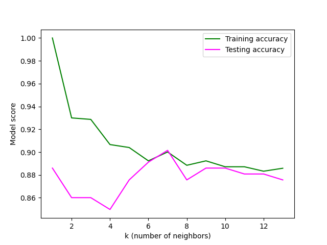

                 # **Defining best argument to launch a second hand e-car sale**

# **Abstract**
The marketing team would like to setup a campaign to sale e-cars. By 2030 only zero emission new cars will be on the market. Although this does not concern yet the second hand car, we need to be one step ahead and taste the water.  
To see what our customers trends are, I've been given the last 6 months cars sold. Although we haven't sold e-cars we do have a good dataset of hybrid cars. I used the hybrid cars sold as my point of comparison with the other types of cars.  

# **Overall comparison**
Here are the different variables I had in hand:  

Column    |    Non-Null Count | Dtype  
  ------    |    -------------- |   -----  
  model  |    6738 non-null  |  object 
  year   |    6738 non-null  |  int64  
  price  |    6738 non-null  |  int64  
  transmission | 6738 non-null |  object 
  mileage |   6738 non-null | int64  
  fuelType |  6738 non-null  |  object 
  tax    |    6738 non-null  |  int64  
  mpg    |    6738 non-null  |  float64
  engineSize  |  6738 non-null  | float64

## **What was the range of prices?**
To visualise the distribution of prices among the different fuel types, I used a violin plot.  
  
We can see that hybrids are more expensive. The median (white line) is higher in the hybrids but we will need to do a statistical test to be certain.
However, what this graph is also showing is that there are two populations of price among the hybrids while the distribution is much more homogene among the petrol car
despite the presence of exceptionnally high value cars.

  Because of the presence of these 2 populations in the Hybrid groups, I won't be using parametric test. 
  I am using first Kruskal Wallis test to test whether there are significant differences between the fuel types.
  Using Kruskal wallis there is at least one significant difference of the price distribution.  
    
  We can see on these histograms that our customers have bought quite a good number of hybrids.  
fuelType  |  Count
-------   |  -----
Petrol    |  4087
Hybrid    |  2043
Diesel    |  503
Other     |  105  

The petrol cars are the first fuel type of cars our customers bought, however the hybrids are the second type of cars our customers bought even though they are more expensive than the Diesels.

## **What kind of cars our customers bought?**  
Model       |   Diesel | Hybrid | Other | Petrol
--------    |  ------- | ------ | ----- | -----                                                         
Auris       |       42 |    498 |     1 |    171
Avensis     |       76 |      0 |     0 |     39
Aygo        |        0 |      0 |    59 |   1902
C-HR        |        0 |    352 |     7 |    120
Camry       |        0 |     11 |     0 |      0
Corolla     |        1 |    181 |     2 |     83
GT86        |        0 |      0 |     0 |     73
Hilux       |       86 |      0 |     0 |      0
IQ          |        0 |      0 |     0 |      8
Land Cruiser|       51 |      0 |     0 |      0
PROACE VERSO |      15 |      0 |     0 |      0
Prius       |        0 |    214 |    18 |      0
RAV4        |      180 |    230 |     5 |     58
Supra       |        0 |      0 |     1 |     11
Urban Cruiser |      1 |      0 |     0 |      3
Verso       |       29 |      0 |     2 |     83
Verso-S     |        0 |      0 |     0 |      3
Yaris       |       22 |    557 |    10 |   1533

To simplify the analysis I have distributed all our models to 6 categories:  
- city_small              
- compact Sedan/family        
- compact SUV              
- mid-size/large family car  
- large SUV/profesional  
- sport                

model_genre                |  Count  
-----------                |  -----
city_small                 |  4091
compact Sedan/family       |  1213
compact SUV                |   956
mid-size/large family car  |   240
large SUV/profesional      |   152
sport                      |    85  

this way we can see our customers preferred to buy very small cars better suited for the cities.  

Kind of cars               | Freq among the Hybrids  |  Freq among the Petrols
------------               | ----------------------  |  -------------
compact Sedan/family       |  0.437102               |  0.062653
compact SUV                |  0.284875               |  0.044298
city_small                 |  0.272638               |  0.842633
mid-size/large family car  |  0.005384               |  0.029858
sport                      |  0.000000               |  0.020558
large SUV/profesional      |  0.000000               |  0.000000  

While the customers who preferred to buy a petrol car largely chose a city car (84%), the customers who decided to invest in a hybrid car turned their choice towards a compact sedan car (43.7%). Importantly, only 6% of our customers who bought a petrol car chose a Sedan kind of car and 4% chose a compact SUV while 28.5% of the customers who bought a Hybrid chose a compact SUV. It is important to note that hybrids have the advantage to combine the classic petrol fuel and electrivity. Hence, they can achieve long distances with much less fuel consumptions. Furthermore, some of these cars go with an auto-charge (and not a plug-in system) of the electric motor. This is a huge advantage over both the e-cars and the petrol cars. therefore this characeristic can easily convince a customer ready to invest a bit more in a car.  

# **Focus on the comparison between Petrol and Hybrids**  
## **Do the hybrids SUVs and sedans have a higher mpg than the petrol cars of the same kind?**  

  

We can see here what would confirm my first thought (see above): the hybird customers who bought a sedan or suv car chose a higher mpg car. 

fuelType   |    Count     |   mean     |    std     |   min  | 25%  | 50%  | 75%  |  max
--------   |   --------   |   -------  |  -----     | ----   | ---- | ---- | ---- | ----
Hybrid     |  1475.0      | 73.919932  | 20.054551  | 49.6   | 68.8 | 74.3 | 78.5 | 235.0
Petrol     |  437.0       | 47.454920  | 8.229537   |  6.0   | 41.5 | 47.1 | 52.3 |  78.5  

After applying a Mann-Whitney U test on the two fuel types, I can conlcude that the mpg of the compact SUV and sedan hybrid cars bought is significantly higher than the petrol cars of the same kinds.  

## **Why would our customers largely prefer to buy a small city petrol car?**
This question is perhaps the most relevant. Indeed, concerning the e-cars (not the hybrids), one would instinctively think that a first purchase would balance more toward an affordable small e-car.  
Furthermore the small city cars were our best sellers (60% of our total sales in the past 6 months).  

  

fuelType  |  count  |  mean   |  std    |    min   |   25%   | 50%  | 75%  |  max
-------   |  -----  |  ----   |  -----  |  ------- |  -----  | ---- | ---- | ----
Hybrid    |  557.0  | 12148.4991 | 1827.110 | 7495.0 | 10890.0 | 12070.0 | 13450.0 | 18868  
Petrol    |3443.0 |  8816.1333 | 2358.942 | 950.0 | 7197.5 | 8695.0 | 10290.0 | 25995.0   

Although clearly the city petrol cars are cheaper than the hybrids of the same kind, we can see that the price range of the hybrids overlaps with the upper price range of the petrol cars. Hence, the people who bought the petrol cars at the same price as the hybrids must have got a reason for that.  
Therefore I'm going to look at the pattern of these "expensive" small petrol cars. If any pattern I find are not different from the one observed with the small hybrids, we can use this argument to convince our futur customers to switch to an electric car.  

  I selected the IQR of the hybrids to restrict the small petrol cars to the right tail of their price distribution.  
  Furthermore, I removed the right tail of the price distribution from the small hybrid cars.  
  Here is the general summary statistics of the different numeric variables.  

-   **Small hybrids**  

Stat method |year | price  |  mileage  | tax   | mpg | engineSize
--------    |---- | ------ |  -------  | ----- | --- | ----------
count | 419 |419  | 419    |  419      |419  | 419  
mean  | 2015.88 |11393.01 | 27925.86 |  25.07| 80.53 | 1.49   
std   | 1.38| 1343.01 | 14886 |52.91 | 4.43 | 0.10   
min   | 2012| 7495 | 2563 | 0.00 | 67.30 | 0.00   
25%   | 2015| 10492| 17028.50 | 0.00 |76.30 | 1.50   
50%   | 2016| 11595| 25054.00 | 0.00 |78.00 | 1.50
75%   | 2017| 12500| 35951.50 | 0.00 |86.00 | 1.50
max   | 2019| 13450| 83288.00 |140.00|86.00 | 1.50  

- **Small expensive petrol cars**  

Stat method |year | price  |  mileage  | tax   | mpg | engineSize
--------    |---- | ------ |  -------  | ----- | --- | ----------
count  | 546 | 546| 546 | 546 | 546  | 546
mean   | 2018.45 | 11803.82 | 8822.09| 138.78 | 52.44 | 1.43
std    | 0.81 | 651.04 | 6367.91 | 27.74 | 5.48 | 0.16
min    |2016 | 10890 | 3.00 | 0.00 |47.10 | 1.00
25%    |2018 | 11202.50 | 4223.50 | 145.00 | 47.90 | 1.50 
50%    |2019 | 11810.50 | 7808.00 | 145.00 | 47.90 | 1.50 
75%    |2019 | 12250.00 | 11842.50| 145.00 | 57.70 | 1.50 
max    |2020 | 13400.00 | 39066.00| 150.00 | 86.00 | 1.50  

By looking at the summary statistic, we can see several differences. For example, the petrol clients were enclined to buy younger cars than the hybrid clients. The age correlates with the lower mileage. However, while the engine size does not seem to be different between hybrids and petrol cars (median = 1.5L), the median tax was much higher for the petrol cars than for the hybrids. This could be an advantage for the hybrids. The customers are willing to pay a tax for a relatively expensive small-city car as long as the car is almost brand new, while the customers who bought an hybrid didn't mind to buy an older car for their tax efficiency.  

## **Can we predict the fuelType decision of a customer?**  

One way to test the validity of my above statement is to build a model around these parameters. The price takes much less weight as I selected only the petrol cars that are in the same range as the hybrids. The idea is to see whether the arguments in favour of buying an "expensive" small petrol car are valid. If they are valid then the model should be able to predict with high accuracy whether a customer will choose a petrol car or an hybrid based on the criteria used.  
For this, I am using a supervised machine learning model called classification. This is a model using a binary response variable, here petrol cars or not petrol cars.  
I am using the most popular model for classification problems: the K Nearest Neighbors (KNN).  
To determine k (the number of neighbors) that would maximise the score of my model, I plotted the score vs k for both the sample I used to train the model and the sample I used to test the model.  
  
Based on this graph, the best number of neighbors to use would be k = 7.  
Based on the confusion matrix, the model is 90.7% accurate which is very good knowing that the model train on a sample size of 772.  
Furthermore, the report shows that the model is good for both predicting a petrol purchase and a hybrid purchase based on these characteristics provided:  
- Year of the model;  
- mileage;  
- mpg;  
- Tax;  
- Engine size;  
- Price.  

 fuelType  |  precision  |  recall | f1-score  | support
 -------   |  ---------  |  ------ | -------   | -------
 Petrol    |  0.90       |  0.94   |   0.92    |   109
 Hybrid    |  0.92       |  0.86   |   0.89    |    84  

 However, knowing that we want to focus on e-cars, the mpg parameter is not apropriate. Indeed, by definition the hybrids use both petrol and electiricity. Hence, they can achieve much longer distance with the same volume of gas as the petrol cars. We need another parameter to compare the distance an e-car achieve with a charge.  

 ## **What about the compact SUV?**
 Proportionally, our customers who decided to go with an Hybrid preferred to buy a compact Sedan. Again, this needs to be taken in the context of the high mpg an hybrid provides that I'm not sure an e-car can provide. Furthermore, charging an e-car takes much longer than loading with gas. Hence, traveling long distance with an e-car will take much more time than traveling long distance with an Hybrid or a petrol car. I will try now to test the other parameters (removing the mpg) and see whether they have an impact on the decision making of our customers.  
fuelType    | Count
------      | ----
Hybrid      |  893
non_Hybrid  |  320  
Because we have this time more hybrids Sedans than all the other fuelType cars that have been sold in the last 6months, I combined all the other fuelType to non-Hybrids.

 ### **Price range**  
   
Although the Hybrids are still more expensive (p=7.15e-47), we can observe a larger overlapping of the price range between Hybrids and non Hybrids from lower range to higher range.  

### **Mileage**
  
There is no significant difference between the mileage distribution of the hybrid Sedans and the non-hybrid Sedans (p=0.6). Hence, mileage is not the reason why customers preferred to buy a Hbrid Sedan.  

### **Tax**
This would be the most obvious argument for choosing a Sedan Hybrid.  
One would think...  
However, let's stay naive and keep our eyes opened.  
  
Interestingly, in both hybrids and non-hybrids we can see 2 populations of taxes. Why is that?  
After subsetting the taxes into 3 groups:  
- 0-£50;  
- £50-£100;  
- £100+;  
I have looked again at the tax distribution.  
  
We can see here more clearly that despite what the violin plot would have suggested for the higher taxes (Fig.8), the non_Hybrid compact Sedan show a higher tax (Mann-Whitney U test, p = 5.22e-44).  
Therefore, the tax could be a good indicator for switching the decision into buying a Hybrid compact Sedan and also potentially an e-car.  
However, I'm still bothered by the evident impact of the mpg which is an argument that cannot be used for the e-cars.  
I will have therefore to develop two predictive models with and without the mpg feature.  

# **Wrapping it up with modelisation**  
One way to decide on the best marketing strategy to sell e-cars, like which feature we shouldfocus on, is to make a predictive modelisation. So after transforming my target variable into a boolean (fuelType = Hybrid or non_Hybrid), I tested among three classification model which one woul dbe the best. I also removed the mpg column, because mpg is much higher in the Hybrids compared to all the other cars but that is not the case for the e-cars. This high mpg is specific to the Hybrids.  
  
We can nicely see on this figure that KNN (K-Nearest Neighbors) has the best accuracy. Note that I used k=7 based on my previous use of this model with the data (Even though I know I only used a subset of the data then.)  
Like I was doing in my previous life, I normalised the features to their maximum using MaxAbScaler where all the feature values are being 0 and 1. This way, I do not modify their distribution (as shown before many of them do not have a normal distribution).  
KNN compares the centroid of one sample x to its neighbors (k neighbors). If its closest neighbors are let's say Hybrids, then KNN will say that x might be a Hybrid.  
Hence, to get such a good accuracy (0.994) there must be a drastic difference of the centroid between Hybrids and non-Hybrids. In other words, Hybrids and non-Hybrids are very well distinct.  
  
As you can see on fig.11 we do have a significant difference between the two categories of fuel type. furhtermore, the centroid in the non-hybrids is very homogene.  
Nonetheless, KNN cannot tell us which feature(s) lead to such a big difference.  
## **Can we find the features responsible for this difference?**
I am not going into the details here (the graphs and code can be checked in my analysis file), but to summarise while the age of the car was about the same between Hybrids and non-Hybrids, the price (obviously!) and the engine size were much higher in the hybrids. The mileage was also higher in the hybrids.  Only the tax was lower.

fuelType  | price |  mileage  |  tax |   engineSize
--------  | ----- |  -------  |  ----|  ----------                                         
Non-Hybrids |0.17345 | 0.134672 | 0.205250  |  0.294774
Hybrids | 0.28354 | 0.157390 | 0.102175  |  0.407649  

So where do the difference of the centroid level comes from so the non-hybrids have a much higher centroid than the hybrids?  
The answer lies in the dummies!  
I had to create dummies for the categorical features (one column per category). However Python removes one of these categories. In other words, if you have 0 in all the dummies columns of your feature, then your sample must belong to the one that is not present. But this means that this sample is missing a 1. Knowing that all my features oscillate between 0 and 1, 1 has a lot of weight in the centroid.  
In the feature transmission Automatic is missing, while in the feature model_genre Compact Sedan family is missing. Remember this?  

Kind of cars               | Freq among the Hybrids  |  Freq among the Petrols
------------               | ----------------------  |  -------------
 compact Sedan/family        |  0.437102               |  0.062653
compact SUV                |  0.284875               |  0.044298
city_small                 |  0.272638               |   0.842633 
mid-size/large family car  |  0.005384               |  0.029858
sport                      |  0.000000               |  0.020558
large SUV/profesional      |  0.000000               |  0.000000   

84% of the petrol cars are small city cars. And the petrol cars represent 87% of the non-hybrid cars. And only 6% of them are compact Sedan/family.  

# **Conclusion and suggestions**  
Our marketing team would like to develop a campaign to sell e-cars (which we haven't sold any until now). The price is a bit of a problem. e-cars, like hybrids are more expensive. So what else can they focus on?  
The data I had in hand does not contain any e-cars but has a good number of hybrids. The hybrids, like the e-cars got the advantage of having a reduced road tax (or even no tax at all depending on some paramaters). However, contrary to the e-cars, the hybrids have a higher mpg. They can achieve great distance with low consumption, but that's because they use 2 systems (combustion and electric). So I decided to remove this feature from my list.
Interestingly, our clients who bought hybrids chose a bigger engine size so perhaps this is something we should focus on for our next e-car market. The mileage was also slightly higher than for the non-hybrids, which is potentially interesting for us. Our clients who chose an hybrid didn't mind to pay more even if the mileage was higher (more used).
Finally the most weighted feature was the type of car. The "non-hybrid" clients largely prefer to buy a small used city car which was not necessarily the case for the "hybrid" clients who preferred to choos a compact sedan family car.  
However, in term of mpg and recharge access, the e-cars will not fit in this category. It would be easier for people to use a small city e-car to go to work and therefore to use on a daily basis so they can re-charge their car either at work if available or at home if they have installed a system.  

Hence, based on the last 6 month behavior of our clients and on what we know about the e-cars, I would recommend to do a campaign focusing on the type of car small-city, the tax and the mileage (somehow our customers don't mind but personally technically speaking I would not give so much confidence in this. This needs to be verify with the average life span of the batteries of the e-cars. We don't want to lie to our customers). 

